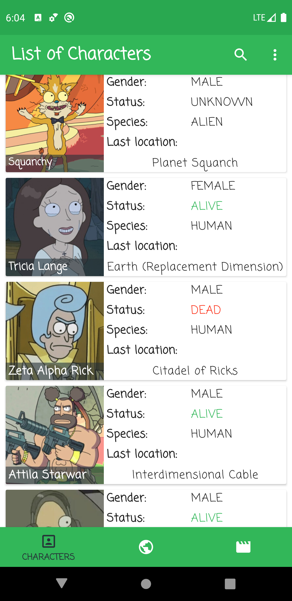
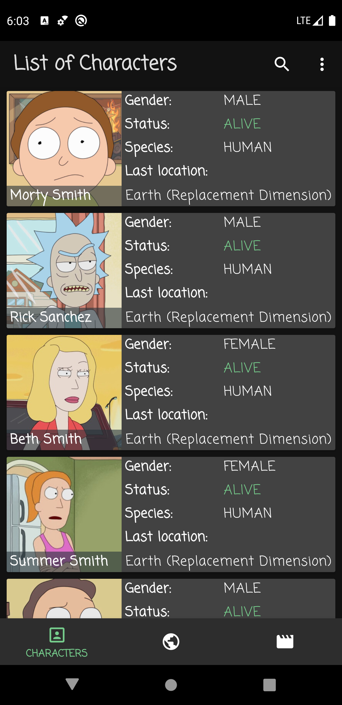

# Characters for Rick and Morty
This project was created to help myself practicing Java and Android development. 
App is created using Android Jetpack library and Material Design library.

## App design and architecture
Project is based on MVVM architecture, written in Java.
Android Jetpack Architecture Components used:
- VieModel
- LiveData
- Room
- ViewBinding 
- Navigation component (Single Activity - many Fragments)
- Paging

App is using components from Material Design library: BottomNavigationView, AppBarLayout, CollapsingToolbarLayout. Theming is implemented in this project using Dark and Light theme with custom styles and text appearance following modern design practices.
This project supports responsive layouts on phones (multi-layout screens for tablets are not yet implemented).

## Credits
Project uses third-party libraries (in no particular order):
- [AndroidFastScroll by zhanghai](https://github.com/zhanghai/AndroidFastScroll);
- [Picasso by square](https://github.com/square/picasso);
- [OkHTTP (for Picasso) by square](https://github.com/square/okhttp);
- [LeakCanary by square](https://github.com/square/leakcanary) in debug mode for detecting memory leaks.

[Rick and Morty RESTful API](https://rickandmortyapi.com/) by [afuh](https://github.com/afuh/rick-and-morty-api) is being used as a source for database.

## Authors
[Alexei Sevcisen](https://github.com/AlexSheva-mason)

## License
Licensed under the [GNU General Public License v3.0](LICENSE)

