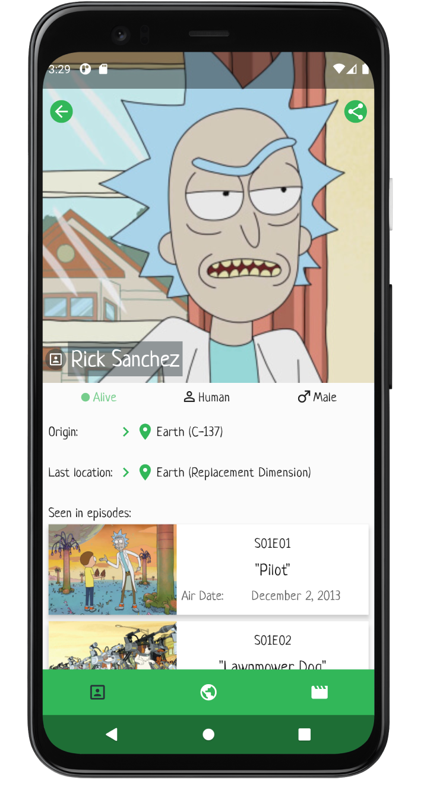
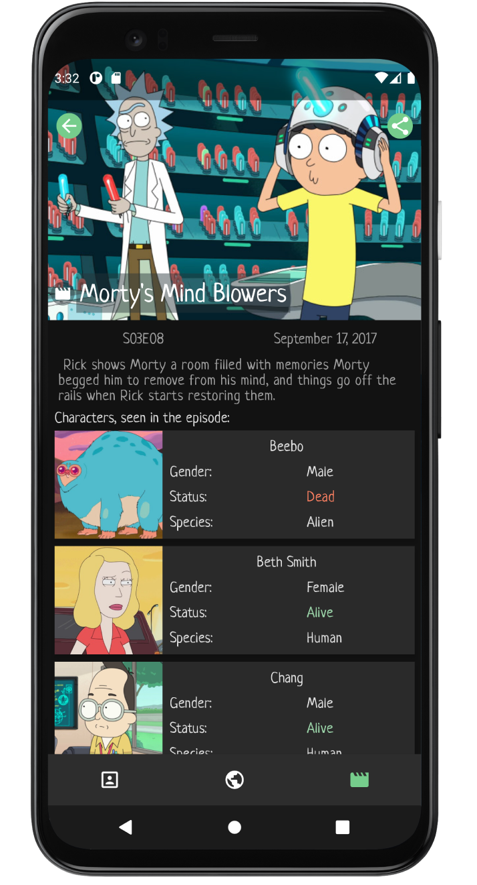
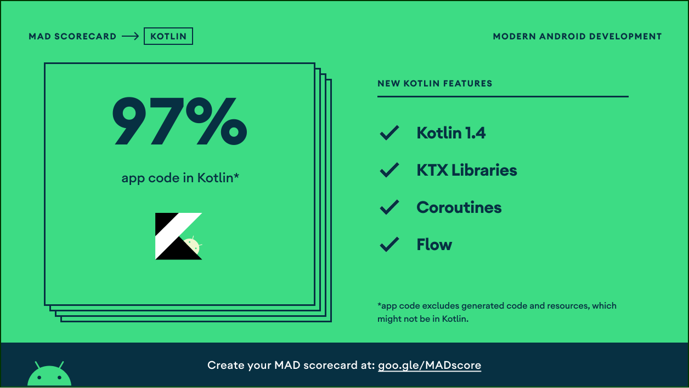

# Characters for Rick and Morty

This project is an android app created for fans of "Rick And Morty" series and provides some valuable information about characters, locations and episodes, allows to search and filter data.
This project originally was created in Java, but now it has been heavily refactored and rewritten in Kotlin.

## App design and architecture
Project is based on MVVM architecture, mostly written in Kotlin using Android Jetpack components and libraries.
App utilises offline first approach and implements "Single Activity - multiple Fragments" navigation pattern.

Android Jetpack Architecture Components used:
- ViewModel
- LiveData
- Room
- ViewBinding 
- Navigation component
- Paging v2

Dependency injection:
- Dagger2

Kotlin libraries:
- Kotlin Coroutines (with Flows)
- various ktx extensions

Testing:
- Unit tests, instrumented tests (JUnit, Mockito)

UI is utilising a dual-theme approach, allowing users to choose from light or dark theme. Components from Material Design library (MaterialCardview, MaterialToolbar, BottomNavigationView etc.) have been used due to their ability to switch between colour Primary and colour Surface.
Detail Fragments are designed in a way that allows the user to drag and move contents - this behaviour is implemented by using MotionLayout.
MaterialContainerTransform (shared element transitions), MaterialFadeThrough and MaterialElevationScale from Material Design library have been used to animate transitions between list and detail fragments.

## MAD Score

## Credits
[Rick and Morty RESTful API](https://rickandmortyapi.com/), [rick-and-morty-api](https://github.com/afuh/rick-and-morty-api) by Axel Fuhrmann is being used as a data source for this project.

Project uses third-party libraries (in no particular order):
- [LeakCanary](https://github.com/square/leakcanary) in debug mode for detecting memory leaks.
- [Retrofit](https://github.com/square/retrofit) for making RESTful API calls
- [Material Dialogs](https://github.com/afollestad/material-dialogs) creating dialog views
- [Timber](https://github.com/JakeWharton/timber) logging
- [Dagger2](https://github.com/google/dagger) dependency injection
- [Glide](https://github.com/bumptech/glide) image loading library
- [Mockito-Kotlin](https://github.com/mockito/mockito-kotlin) kotlin helper functions for Mockito
- [Truth](https://github.com/google/truth) assertions library for unit testing

## Authors
[Alexei Sevcisen](https://github.com/AlexSheva-mason)

## License
Licensed under the [GNU General Public License v3.0](LICENSE)

